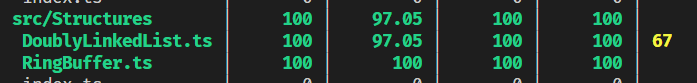
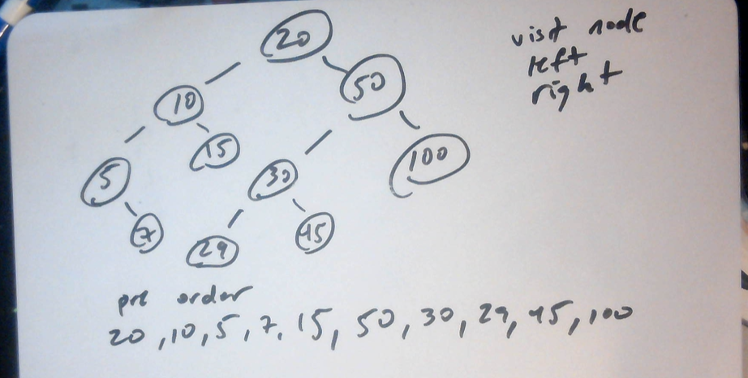
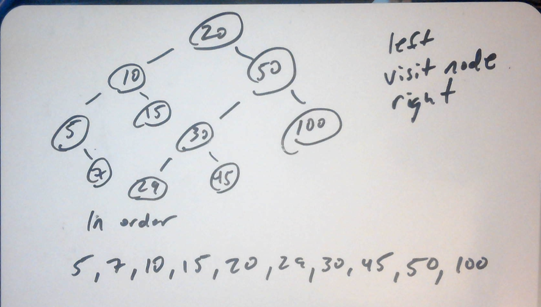
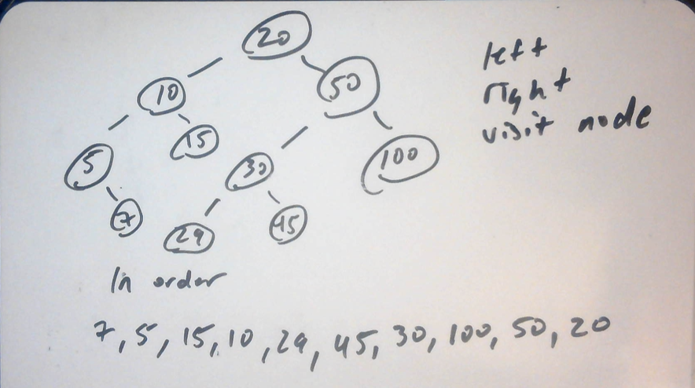
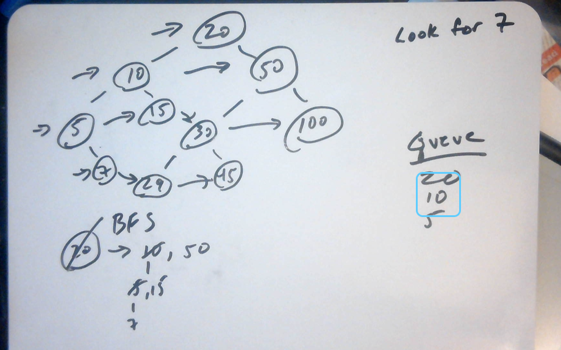

# c5-ts-fp

[](https://dl.circleci.com/status-badge/redirect/gh/C5m7b4/c5-ts-fp/tree/master)


[](https://codecov.io/gh/C5m7b4/c5-ts-fp)

this is my small functional library for typescript.

here are the functions that I am covering so far

- [append](#append)
- [ArrayList](#arraylist)
- [Binary Search](#binary-search)
- [BinarySearchTree](#binary-search-tree)
- [Box](#box)
- [Breadth First Search](#breadth-first-search)
- [Bubble Sort](#bubble-sort)
- [CompareBinaryTries](#compare-binary-tries)
- [compose](#compose)
- [curry](#curry)
- [date functions](#date-functions)
- [Double Linked List](#double-linked-list)
- [format functions](#format-functions)
- [In Order Search](#in-order-search)
- [isValid](#isvalid)
- [Linear Search](#linear-search)
- [LinkedList](#singly-linked-list)
- [Maybe](#maybe)
- [Post Order Search](#post-order-search)
- [prop](#prop)
- [Pre Order Search](#pre-order-search)
- [RingBuffer](#ringbuffer)
- [Stack](#stack)
- [swap](#swap)
- [trace](#trace)
- [Tree](#tree)
- [Queue](#queue)
- [QuickSort](#quick-sort)

coming soon

- Task
- Either

## example usage

to install

```js
npm install c5-ts-fp
```

or

```js
yarn add c5-ts-fp
```

### curry

to use this function, we need to take a function that has an airity of more than on and condense it to consecutive functions:

```js
const add = (a, b) => a + b;

const curriedAdd = curry(add);
console.log(curriedAdd(5)(5));
```

### compose

to use this function, we need some helper functions that we can compose

```js
const addOne = (x) => x.map((y) => y + 1);
const addTwo = (x) => x.map((y) => y + 2);

const arr = [1, 2, 3, 4, 5, 6];

const r = compose(addOne, addTwo);
console.log(r(arr));
```

### Box

to us this function, we need an array of data that we can dynamically filter:

```js
const items = Box(data)
  .map((x) => x.filter((i) => i.dept === 1))
  .map((x) => x.filter((i) => i.vendor === 1))
  .map((x) => x.filter((i) => i.category === 1))
  .map((x) => x.filter((i) => i.price > 2.0))
  .map((x) => x.filter((i) => i.price < 3.0))
  .fold((x) => x);

console.log(items);
```

### trace

this is a useful function if you need to add logging into your monad

```js
const items = Box(data)
  .map((x) => x.filter((i) => i.dept === 1))
  .map((x) => trace("after dept filter")(x))
  .map((x) => x.filter((i) => i.vendor === 1))
  .map((x) => x.filter((i) => i.category === 1))
  .map((x) => x.filter((i) => i.price > 2.0))
  .map((x) => x.filter((i) => i.price < 3.0))
  .fold((x) => x);

console.log(items);
```

### prop

this function will extract a property out of an object

```js
const obj = {
  id: 1,
  name: 'mike'
}

console.log(prop('mike')(obj))
```

there is no need to curry this function because it is already a higher order function. it takes in a property name and returns a function that takes in an object and then returns the value of that property of that object.

### append

this simple function just appends one string to another

```js
console.log(append("second")("first-"));
```

there is no need to curry this function becuase it is also a higher order function

### maybe

lets look at an example of how we can use maybe. Im gonna add some test data so we can try out the maybe. you can see an example of this in the example application attached:

```js
const maybeData = Maybe.just(data1)
  .map((x) => x.filter((i) => i.dept === 32))
  .map((x) => x.filter((i) => i.price > 2))
  .map((x) => x.map((i) => ({ ...i, price: formatMoney(i.price) })))
  .extract();

console.log(maybeData);
```

even if the data passed in is null, the Maybe won't break.

### Stack

stack is a data structure that is LIFO (last in first out)
these are the methods

- push
- pop
- peek

### Queue

queue is a data struccture that is FIFO (first in first out)
these are the methods

- enqueue
- dequeue
- size

### Linear Search

once again, we are going to use our test data. we can also run this linear search on any array of numbers, dates, string, or objects. the syntax would look like this:

```js
const result = linearSearch(data, 2, "id");
```

### Binary Search

this can only work on data that is already sorted, so if you are searching by an already sorted id, this is perfect. if you are searching by description but you data is sorted by id, you will need to sort this data before you try to use a binary search

```js
const result = binarySearch(data, 2, "id");
```

### Bubble Sort

i figures since we talked about needing to sort this would be a good time to add this

parameters

- array to sort
- ascending true or false. defaults to true
- property of array to sort on
- boolean flag for if its a date you are sorting by

```js
    const result = bubbleSort(dataWithDates, false, "expires", true);
```

### swap

this function takes in an array and a position and swaps it with the next element in the array. used in Bubble Sort so far

### RingBuffer

this is like a javascript array, but you specify an initial size. If a value is then added to the ringbugger, it will rotate back around and add that value. so, basically, its an array that acts like a ring based on the specified size. I know that's a little confusing, so let's take a look at an example

```js
    const ring = new RingBuffer<number>(5);
    ring.fromArray([12, 14, 16, 17, 18, 19, 20, 21, 22, 23, 24, 25]);
    expect(ring).toEqual({
      buffer: [21, 22, 23, 24, 25],
      size: 5,
    });
```

notice that we passed a lot of values into the ringbuffer, but only the last 5 will actually make the test pass.

we can very easily adapt this to work with object arrays:

```js

type Client = {
  id: number;
  name: string;
};

    const ring = new RingBuffer<Client>(5);
    ring.add({
      id: 1,
      name: "mike",
    });
    expect(ring).toEqual({ buffer: [{ id: 1, name: "mike" }], size: 5 });
```

### Quick Sort

another sorting algorithm that uses a divide and conquer approach

### isValid

this function will tell you if any number, string, object, or array is actually valid or not

### date functions

we have getDateDetails which will return and object with the month, day and year

```js
    const testDate = new Date(2022, 0, 1);
    const { day, month, year } = getDateDetails(testDate);
```

we have daysInMonth which could be used when creating calendar objects

```js
    expect(daysInMonth(0, 2022)).toEqual(31);
```

we have isSameMonth

```js
    const testDate = new Date(2022, 2, 5);
    const goodDate = new Date(2022, 2, 15);
    const badDate = new Date(2022, 1, 5);
    expect(isSameMonth(goodDate, testDate)).toBeTruthy();
    expect(isSameMonth(badDate, testDate)).toBeFalsy();
```

we have isSameDay

```js
    const testDate = new Date(2022, 2, 5);
    const goodDate = new Date(2022, 2, 5);
    const badDate1 = new Date(2022, 2, 6);
    const badDate2 = new Date(2021, 2, 5);
    expect(isSameDay(goodDate, testDate)).toBeTruthy();
    expect(isSameDay(badDate1, testDate)).toBeFalsy();
    expect(isSameDay(badDate2, testDate)).toBeFalsy();
```

we have getDayOfDate

```js
    expect(getDayOfDate(new Date(2022, 2, 27))).toEqual("Sunday");
```

we have getMonthName

```js
    expect(getMonthName(new Date(2022, 0, 1))).toEqual("January");
```

### format functions

we have formatMoney

```js
    expect(formatMoney("1.1")).toEqual("$1.10");
```

we have formatDate

```js
    expect(formatDate("1/1/2020 2:00 PM")).toEqual("1/1/2020");
```

### double linked list

this one is still a little interesting to me as this is a new concept. we have done testing with arrays of objects and no code changes seem to need to be made. this is something I will play with a little more to get  more familiar. 

```diff
- list.append(5);
+ list.append({ id: 1, name: "mike" });
```

There is still one line of code that I have not been able to figure out how to create a test for, so if somebody else can help, feel free.



### Pre Order Search

performs tree searching in a pre order manner. these are Depth first searches. these searches use a stack like operation. it looks something like this:



### In order Search

performs tree searching in an in order manner. these are Depth first searches. these searches use a stack like operation. it looks something like this:



### Post Order Search

performs tree searching in a post order manner. these are Depth first searches. these searches use a stack like operation. it looks something like this:



### Breadth First Search

this search uses a queue and operates on binary trees. it works like this:



### Compare Binary Tries

this is a function that will take two trees of data and tell you if they are equal or not

### Tree

this is a very basic Tree that I'm playing with right. I'll come back to this one later and implement some more functionality, but I would like to create some better trees first

### Arraylist

this is a pretty simple implementation of arrays but using objects

### Singly Linked List

a very simple singly linked list. params:

- push
- pop
- find
- get
- delete

### Binary Search Tree

methods

- insert
- search
- preOrderTraversal
- inOrderTraversal
- postOrderTraversal

I think I need to investigate object a little more with this in the testing
